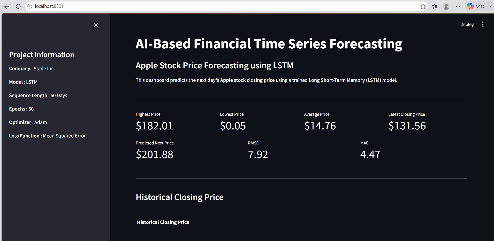
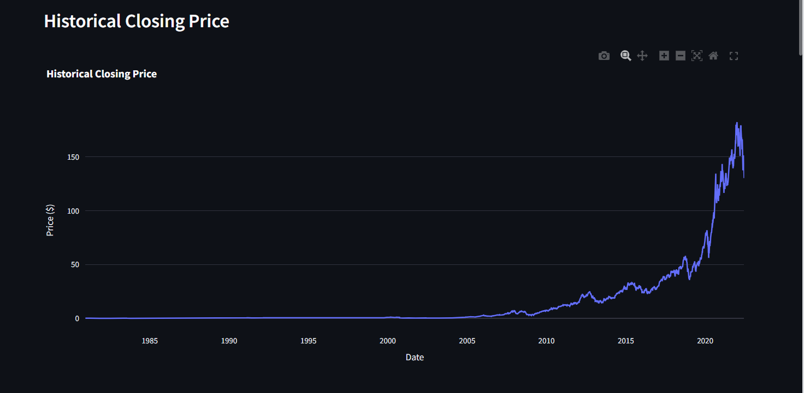
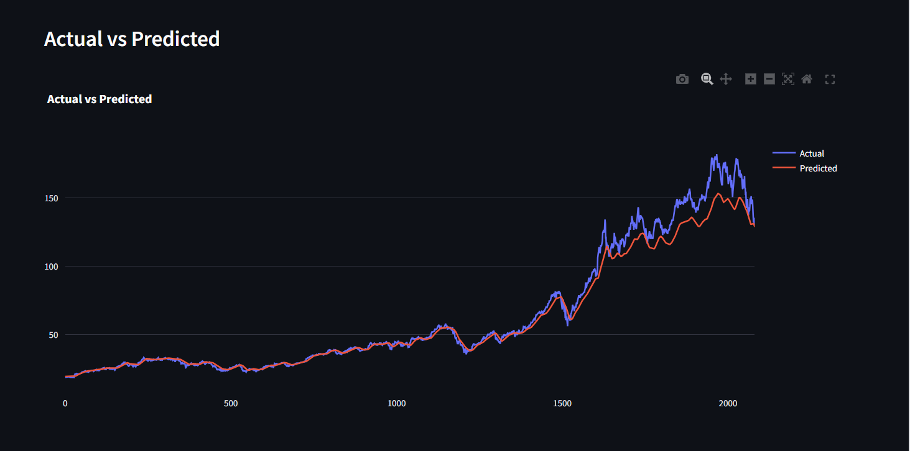

# AI-Based Financial Time Series Forecasting using LSTM

An end-to-end deep learning project that forecasts the next day's Apple stock closing price using a Long Short-Term Memory (LSTM) neural network. The project includes data preprocessing, model training, evaluation, and an interactive Streamlit dashboard for visualizing stock trends and predictions.

---

## Features

- Time series forecasting using LSTM
- Data preprocessing and normalization
- 60-day sliding window sequence generation
- Model training with EarlyStopping and ModelCheckpoint
- Performance evaluation using RMSE and MAE
- Interactive Streamlit dashboard
- Historical stock price visualization
- Candlestick chart
- Actual vs Predicted stock price comparison
- Next-day stock price prediction
- Download processed dataset

---

## Project Structure

```
AI-Based Financial Time Series Forecasting using LSTM
│
├── app
│   ├── app.py
│   ├── predict.py
│   ├── charts.py
│   ├── utils.py
│   └── config.py
│
├── assets
│   └── screenshots
│
├── data
│   ├── apple_stock.csv
│   ├── clean_stock_data.csv
│   ├── X_train.npy
│   ├── X_test.npy
│   ├── y_train.npy
│   └── y_test.npy
│
├── models
│   ├── best_lstm_model.h5
│   ├── final_lstm_model.h5
│   ├── lstm_model.keras
│   └── scaler.pkl
│
├── notebooks
│   ├── 01_Data_Analysis.ipynb
│   ├── 02_Data_Preprocessing.ipynb
│   ├── 03_LSTM_Model.ipynb
│   ├── 04_Model_Training.ipynb
│   └── 05_Model_Evaluation.ipynb
│
├── requirements.txt
├── README.md
└── LICENSE
```

---

## Dataset

- Apple Historical Stock Prices
- Features:
  - Date
  - Open
  - High
  - Low
  - Close
  - Volume

---

## Technologies Used

- Python
- TensorFlow / Keras
- NumPy
- Pandas
- Scikit-learn
- Plotly
- Matplotlib
- Streamlit
- Joblib

---

## Model Architecture

```
Input Sequence (60 Days)
          │
          ▼
     LSTM (64 Units)
          │
       Dropout
          │
     LSTM (64 Units)
          │
       Dropout
          │
      Dense (25)
          │
      Dense (1)
          │
Predicted Closing Price
```

---

## Workflow

1. Load historical stock price dataset
2. Perform exploratory data analysis
3. Normalize closing prices using MinMaxScaler
4. Generate 60-day input sequences
5. Train LSTM model
6. Evaluate model using RMSE and MAE
7. Predict next-day closing price
8. Deploy interactive dashboard using Streamlit

---

## Dashboard Preview

### Dashboard



---

### Historical Stock Price



---

### Prediction Dashboard



---

## Installation

Clone the repository

```bash
git clone https://github.com/VinitaPatil2005/AI-Based-Financial-Time-Series-Forecasting-using-LSTM.git
```

Move into the project directory

```bash
cd AI-Based-Financial-Time-Series-Forecasting-using-LSTM
```

Install dependencies

```bash
pip install -r requirements.txt
```

Run the Streamlit application

```bash
streamlit run app/app.py
```

---

## Results

The model learns historical stock price patterns and predicts the next day's closing price using a sequence of the previous 60 trading days.

Evaluation Metrics

- RMSE
- MAE

The dashboard displays:

- Historical Closing Price
- Last 30 Trading Days
- Candlestick Chart
- Actual vs Predicted Price
- Next-Day Price Prediction
- Dataset Statistics

---

## Future Improvements

- Multi-stock forecasting
- Live stock data integration
- GRU and Bidirectional LSTM comparison
- Hyperparameter tuning
- Transformer-based forecasting
- Cloud deployment

---

## Author

**Vinita Patil**

GitHub: https://github.com/VinitaPatil2005

LinkedIn: https://www.linkedin.com/in/vinita-patil-a87052303/

---

## License

This project is licensed under the MIT License.
